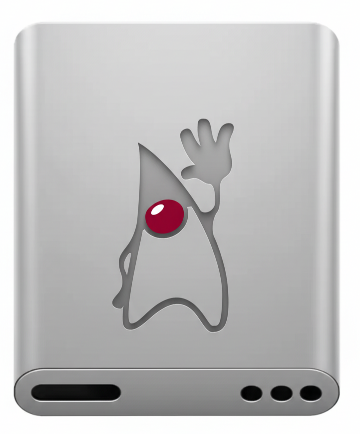
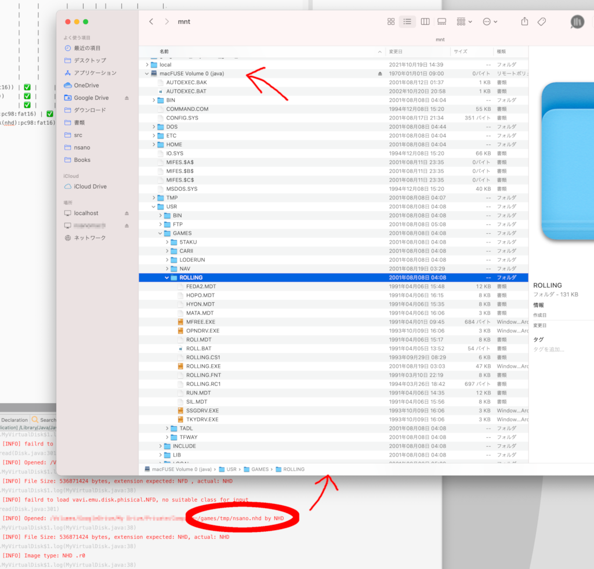

[](https://jitpack.io/#umjammer/vavi-nio-file-jnode)
[](https://github.com/umjammer/vavi-nio-file-jnode/actions/workflows/maven.yml)
[](https://github.com/umjammer/vavi-nio-file-jnode/actions/workflows/codeql-analysis.yml)

[](https://github.com/umjammer/vavi-apps-fuse)

# vavi-nio-file-jnode



A Java nio fileSystem SPI based on [jnode](https://github.com/jnode/jnode).

you can also mount all formats using fuse.

### Status

| fs                           | list | upload | download | copy | move | rm | mkdir | cache | watch | comment                                                                   |
|------------------------------|:----:|:------:|:--------:|:----:|:----:|:--:|:-----:|:-----:|:-----:|---------------------------------------------------------------------------|
| nfs2                         |      |        |          |      |      |    |       |       |       |                                                                           |
| exfat                        |  ✅   |        |          |      |      |    |       |       |       |                                                                           |
| iso9660                      |      |        |          |      |      |    |       |       |       |                                                                           |
| jfat                         |  ✅   |        |          |      |      |    |       |       |       |                                                                           |
| ext2                         |      |        |          |      |      |    |       |       |       |                                                                           |
| hfs                          |      |        |          |      |      |    |       |       |       |                                                                           |
| ftpfs                        |      |        |          |      |      |    |       |       |       | [edtFTPj](https://enterprisedt.com/products/edtftpj/)                     |
| smbfs                        |      |        |          |      |      |    |       |       |       | [jcifs-ng](https://github.com/AgNO3/jcifs-ng)                             |
| ntfs                         |      |        |          |      |      |    |       |       |       |                                                                           |
| fat                          |      |        |          |      |      |    |       |       |       |                                                                           |
| hfsplus                      |      |        |          |      |      |    |       |       |       |                                                                           |
| apfs                         |      |        |          |      |      |    |       |       |       | [java-fs](https://github.com/VivekDudani/java-fs)                         |
| xfs                          |      |        |          |      |      |    |       |       |       | [java-fs](https://github.com/VivekDudani/java-fs)                         |
| emu                          |  ✅   |        |          |      |      |    |       |       |       | [vavi-nio-file-emu](https://github.com/umjammer/vavi-nio-file-emu)        |
|                              |      |        |          |      |      |    |       |       |       |                                                                           |
| apm                          |      |        |          |      |      |    |       |       |       | partition                                                                 |
| gpt                          |      |        |          |      |      |    |       |       |       | partition                                                                 |
| ibm (dmg:jfat(fat16))        |  ✅   |        |          |      |      |    |       |       |       | partition                                                                 |
| pc98 (jfat(fat16))           |  ✅   |        |          |      |      |    |       |       |       | partition                                                                 |
| raw (exfat)                  |  ✅   |        |          |      |      |    |       |       |       | virtual partition                                                         |
| vdisk (nhd:pc98:fat16)       |  ✅   |        |          |      |      |    |       |       |       | [virtual disk](https://github.com/umjammer/vavi-nio-file-emu), partition  |
| fuse (vdisk(nhd):pc98:fat16) |  ✅   |        |          |      |      |    |       |       |       | [fuse](https://github.com/umjammer/vavi-net-fuse), virtualDisk, partition |
| vdisk (d88:raw:emu(n88))     |  ✅   |        |          |      |      |    |       |       |       | virtualDisk, rawPartition, emu                                            |
| vdisk (d88:pc98:fat16)       |  ✅   |        |          |      |      |    |       |       |       |                                                                           |
| vdisk (fdi:pc98:fat12)       |  ✅   |        |          |      |      |    |       |       |       | [virtual disk](https://github.com/umjammer/vavi-nio-file-emu), partition  |

## Install

 * [maven](https://jitpack.io/#umjammer/vavi-nio-file-jnode)

## Usage

### JSR-203 & fuse

```java
    URI uri = URI.create("jnode:file:/foo/bar.nhd");
    fs = FileSystems.newFileSystem(uri, Collections.emptyList());
    Fuse fuse = Fuse.getFuse().mount(fs, MOUNT_POINT, Collections.emptyList());
```

### system properties

* `org.jnode.file.encoding` ... filename encoding for `Charset#forName(String)`, default is `MS932`
* `vavix.io.partition.validator.fat` ... , validator for finding fat literal default is `false`
* `vavix.io.partition.validator.ipl` ... , validator for finding ipl literal default is `true`
* `vavix.io.partition.validator.nec` ... , validator for finding nec literal, default is `true`
* `vavix.io.fat.PC98BiosParameterBlock.validation` ... `true`: do default validation, `false`: no validation, *else*: validation function name `class#method`, the method must return `boolean`
* `org.jnode.fs.jfat.ATBootSector.validation` ... `true`: do default validation, `false`: no validation, *else*: validation function name `class#method`, the method must return `boolean`

### for emulator user

it's possible to mount old school japanese computer pc-9801's virtual disk by fuse.<br/>
we can see nostalgic files `autoexec.bat`, `command.com`, `mifes...` etc.<br/>
time stamps are so old lol.



## References

 * [vavi-nio-file-emu](https://jitpack.io/#umjammer/vavi-nio-file-emu) ... PC-98 FAT
 * https://github.com/VivekDudani/java-fs

## TODO

 * `BlockDeviceAPI` can only support \[header] + solid image
   * api separation from device is in high esteem
   * however we need accessing disk data by logical sector No. but offset like `BiosDeviceAPI` for emu disks ~~like d88~~ ... resolved by ad-hoc way

---

<sub>disk image ©️ Apple Inc. edited by Nano Banana</sub>
